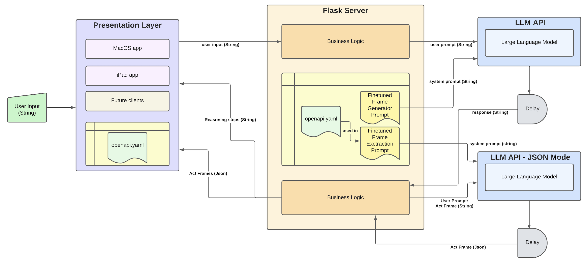

# FLINT-conversation-service


## About
The FLINT-conversation-service implements the backend service of the Flint-it application prototype. The service can be used together with the [Flint-it front end service](https://github.com/JuliusHuizing/Flint-It), or can be coupled to existing or future front-end services that can handle the requests and responses specified in the OpenAPI specification as defined in the *./openapi.yaml" file.


## Architecture


The back-end layer takes as an input any string (which is expected to correspond to some source of a norm) and returns (1) all the ACT frames it could identify and generate from that string in JSON format and (2) the reasoning steps it used to construct those frames in natural language. 

The backend layer implements three main subcomponents: 

The first subcomponent is responsible for taking the input string and redirecting it to the ChatGPT API as a user prompt. As a system prompt, it uses a locally stored prompt that is experimentally fine-tuned to generate ACT frames for sources of norms. 

The second subcomponent is responsible for splitting the previous response up into  two parts: One part that described the reasoning steps used to generate the ACT frames and one part that describes the generated ACT frames in semi-structured format. 

The third and final subcomponent is responsible for transforming the semi-structured ACT frames into json format and send them back as a response together with the reasoning steps. To transform the ACT frames into JSON format, this subcomponent sends the semi-structured ACT-FRAMES to the ChatGPT API as a user prompt while using a system prompt a locally stored prompt experimentally fine-tuned to transform the semi-structured output from the previous step into json format. This is the component that ultimately ensures the service implements the capabilities described in the OAS as dicussed in section \ref{OAS}.


## Usage

### Installing Dependencies:
This project uses Poetry as a dependency manager. If you do not have poetry installed, refer to [Poetry's docs](https://python-poetry.org/docs/) for installation instructions.

Run the following command to install the project dependencies as defined in the pyproject.toml file:

```bash
poetry install
```

and activate the shell:
```bash
poetry shell
```

### Running the Application:
> [!IMPORTANT]
> By default, the app runs on port 8000. Consider not using port 5000 because [this port is used by the Control Center application on MacOS systems](https://stackoverflow.com/questions/72795799/how-to-solve-403-error-with-flask-in-python). Using port 5000 can therefore lead to errors when accessing the server, such as a 403 error.

run the app by running:
```bash
python app.py
```

Inspect the stream functionality:
```bash
curl -X POST -H "Content-Type: application/json" -d '{"message": "summarize the history of the US in 500 words"}' http://localhost:8000/stream_reasoning
```

